##### dkeg 2015, 2016
##### collection of scrots

#####[simplicity](https://github.com/dkeg/crayolo/blob/master/colors/simplicity)
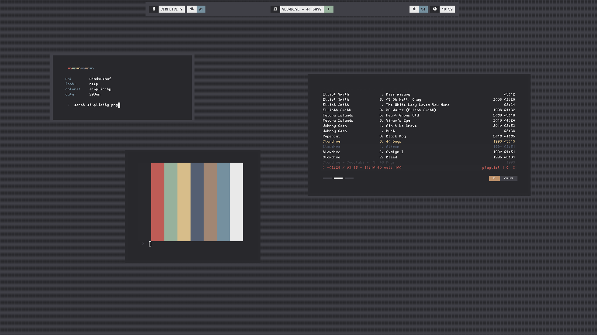

#####[bluetype](https://github.com/dkeg/crayolo/blob/master/colors/bluetype)
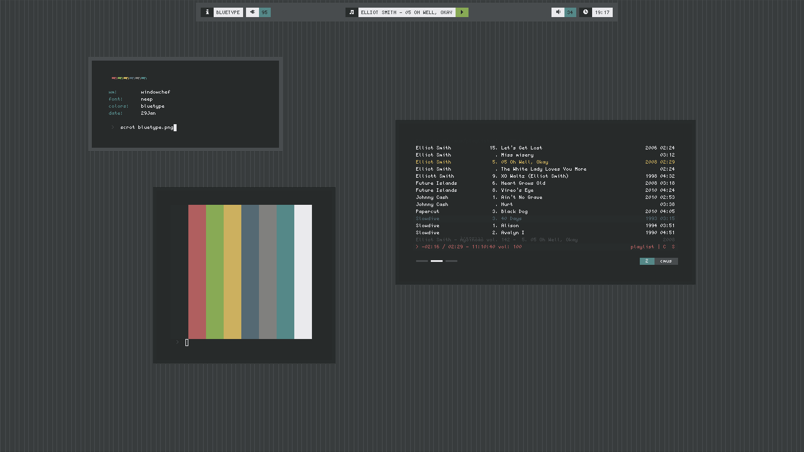

#####[traffic](https://github.com/dkeg/crayolo/blob/master/colors/traffic)
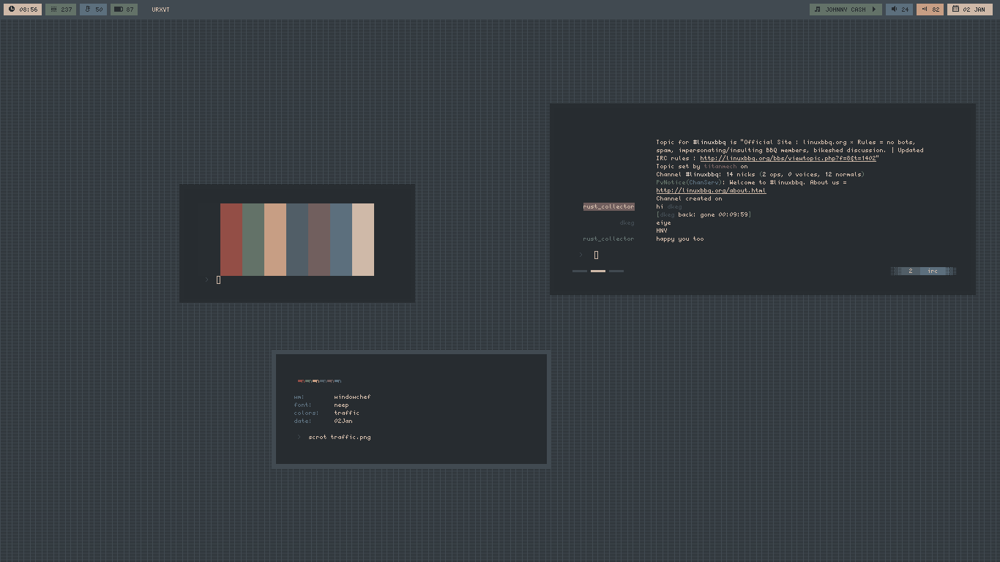

#####[tealights](https://github.com/dkeg/crayolo/blob/master/colors/tealights)
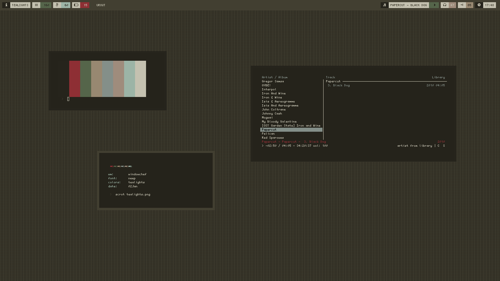

#####[view](https://github.com/dkeg/crayolo/blob/master/colors/view)

#####[kit](https://github.com/dkeg/crayolo/blob/master/colors/kit)

#####[sprout](https://github.com/dkeg/crayolo/blob/master/colors/sprout)

#####[shade](https://github.com/dkeg/crayolo/blob/master/colors/shade)
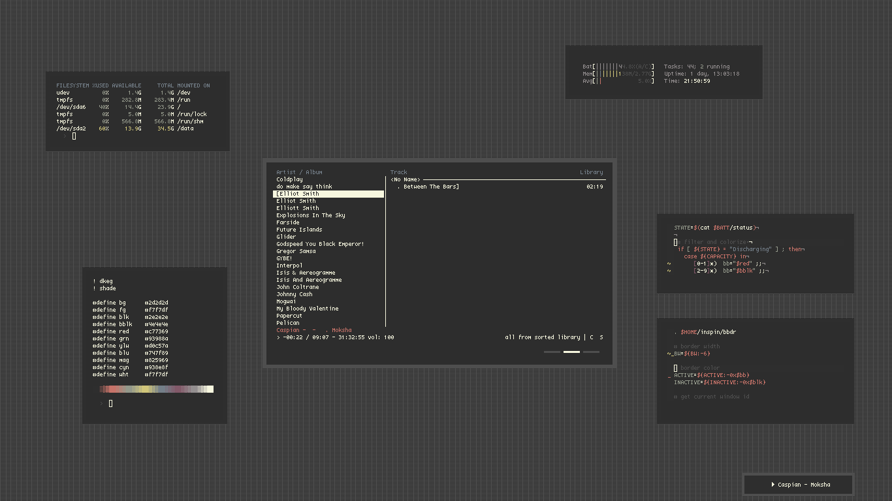

#####[spire](https://github.com/dkeg/crayolo/blob/master/colors/spire)

#####[skigh](https://github.com/dkeg/crayolo/blob/master/colors/skigh)

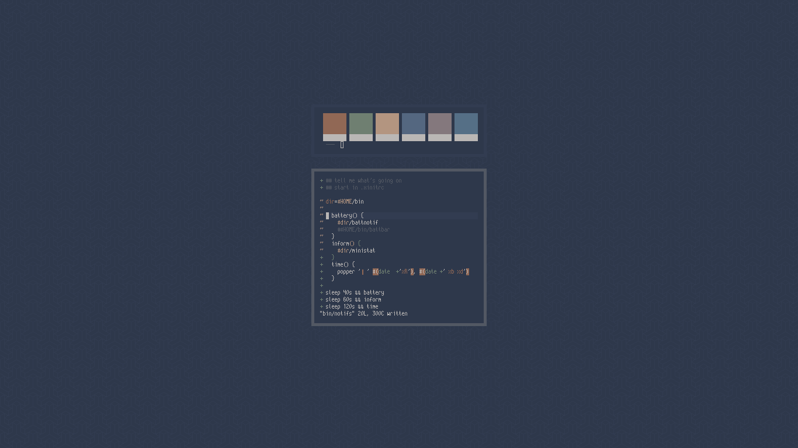

#####[brownstone](https://github.com/dkeg/crayolo/blob/master/colors/brownstone)

#####[5725](https://github.com/dkeg/crayolo/blob/master/colors/5725)
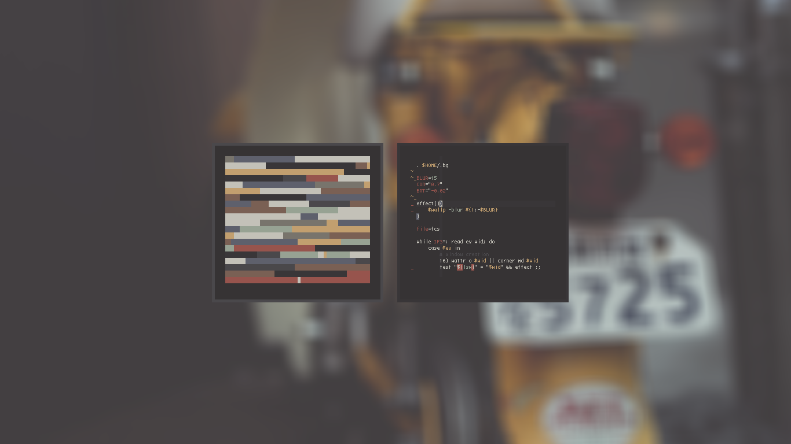

#####[flapr](https://github.com/dkeg/crayolo/blob/master/colors/flapr)

#####[slate](https://github.com/dkeg/crayolo/blob/master/colors/slate)
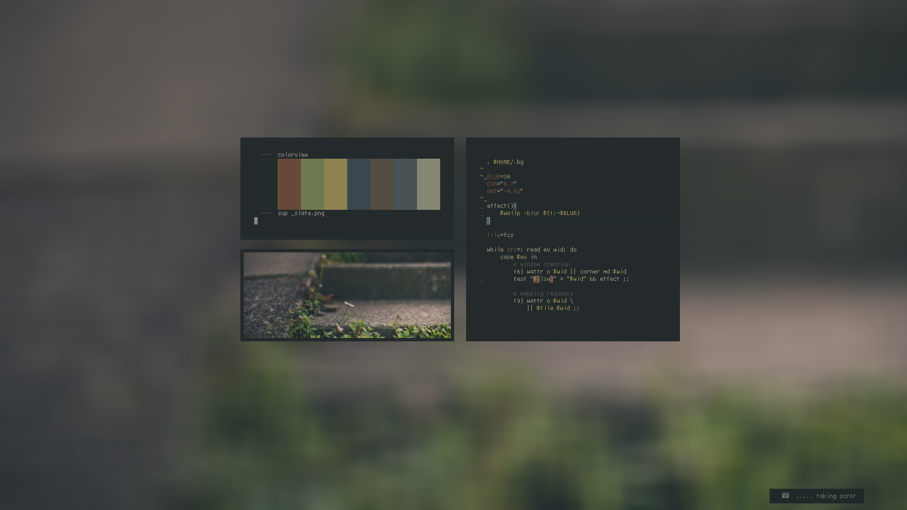

#####[fendr](https://github.com/dkeg/crayolo/blob/master/colors/fendr)
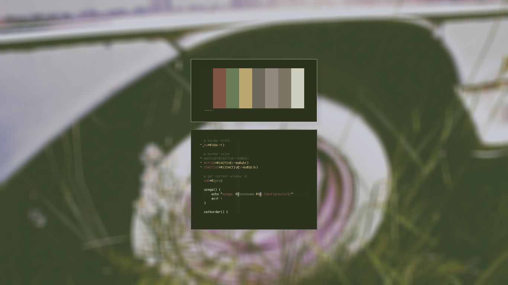

#####[lumen](https://github.com/dkeg/crayolo/blob/master/colors/lumen)
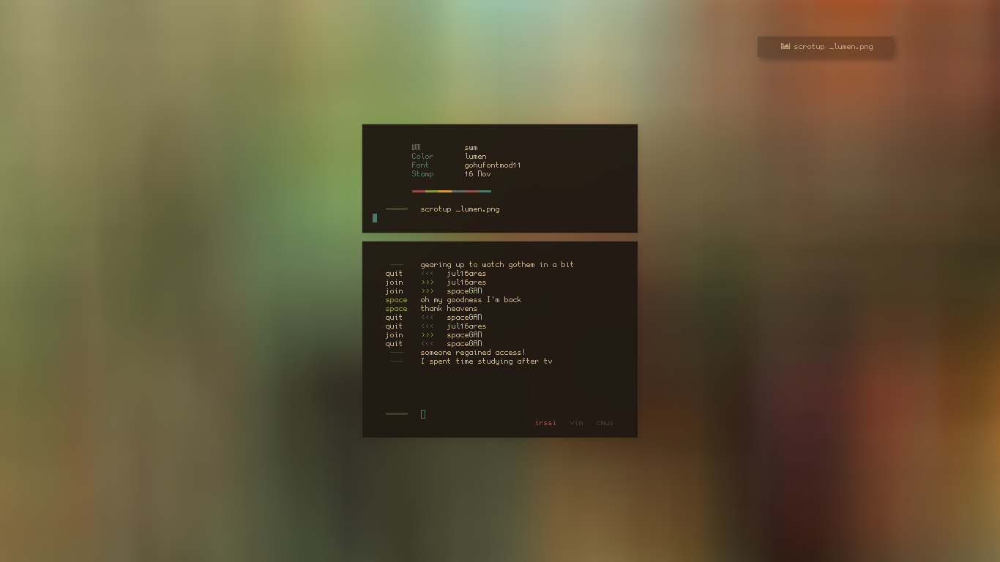

#####[urban](https://github.com/dkeg/crayolo/blob/master/colors/urban)
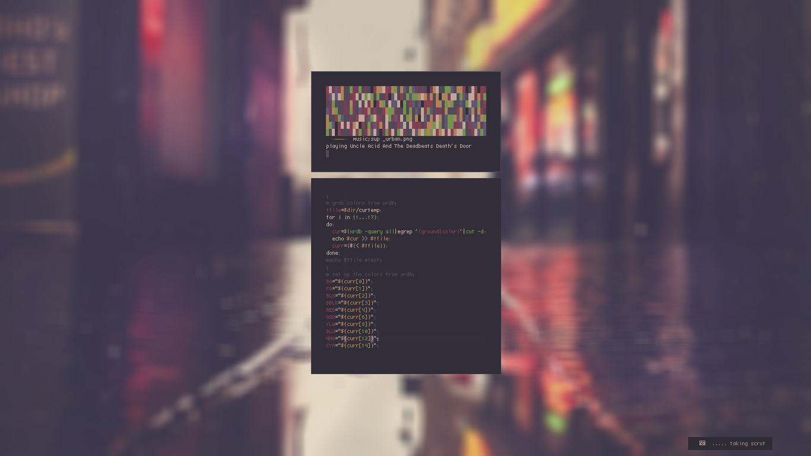

#####[vans](https://github.com/dkeg/crayolo/blob/master/colors/vans)
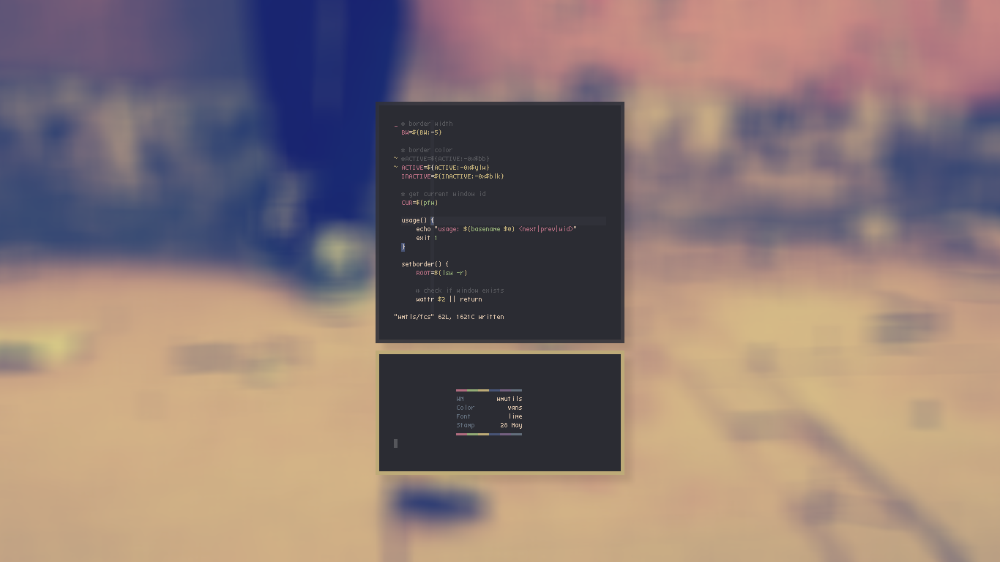

#####[forst](https://github.com/dkeg/crayolo/blob/master/colors/forst)

#####[transposet](https://github.com/dkeg/crayolo/blob/master/colors/transposet)
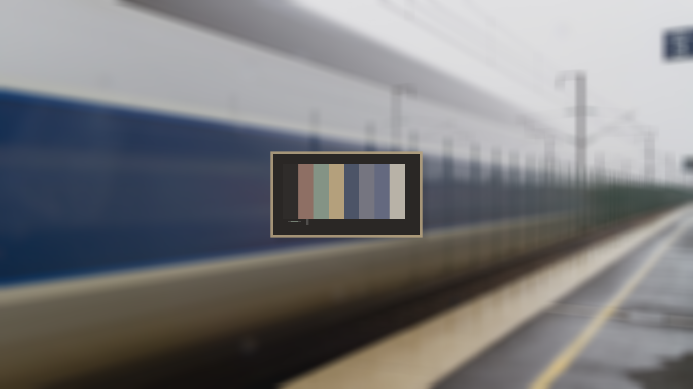

#####[sundr](https://github.com/dkeg/crayolo/blob/master/colors/sundr)

#####[book](https://github.com/dkeg/crayolo/blob/master/colors/book)

#####[chaires](https://github.com/dkeg/crayolo/blob/master/colors/chaires)
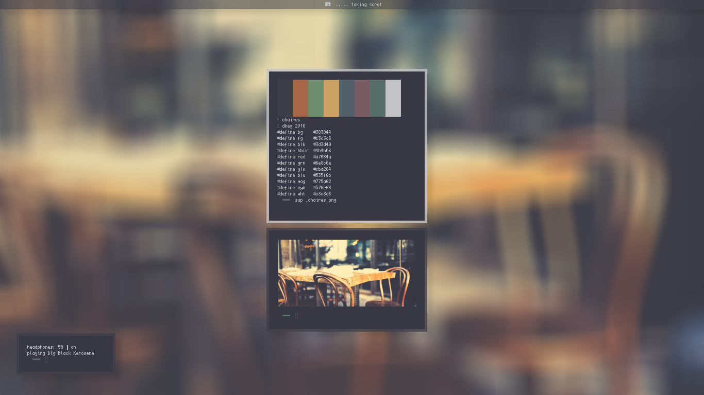

#####[diner](https://github.com/dkeg/crayolo/blob/master/colors/diner)

#####[parkd](https://github.com/dkeg/crayolo/blob/master/colors/parkd)
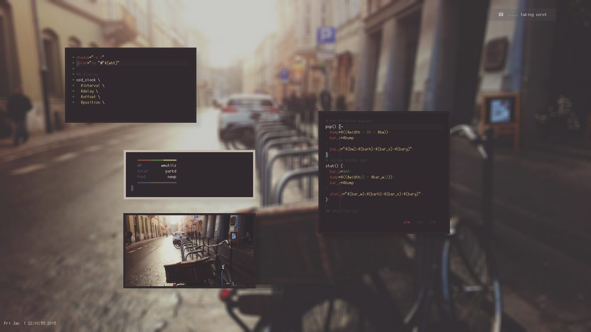

#####[relax](https://github.com/dkeg/crayolo/blob/master/colors/relax)

#####[paints](https://github.com/dkeg/crayolo/blob/master/colors/paints)

#####[petal](https://github.com/dkeg/crayolo/blob/master/colors/petal)

#####[provrb](https://github.com/dkeg/crayolo/blob/master/colors/provrb)

#####[blok](https://github.com/dkeg/crayolo/blob/master/colors/blok)

#####[stv](https://github.com/dkeg/crayolo/blob/master/colors/stv)

#####[raiin](https://github.com/dkeg/crayolo/blob/master/colors/raiin)

#####[bulb](https://github.com/dkeg/crayolo/blob/master/colors/bulb)

#####[novmbr](https://github.com/dkeg/crayolo/blob/master/colors/novmbr)

#####[autm](https://github.com/dkeg/crayolo/blob/master/colors/autm)

#####[wintry](https://github.com/dkeg/crayolo/blob/master/colors/wintry)

#####[escen](https://github.com/dkeg/crayolo/blob/master/colors/escen)

#####[depth](https://github.com/dkeg/crayolo/blob/master/colors/depth)

#####[fury](https://github.com/dkeg/crayolo/blob/master/colors/fury)

#####[squares](https://github.com/dkeg/crayolo/blob/master/colors/squares)

#####[scape](https://github.com/dkeg/crayolo/blob/master/colors/scape)

#####[harbing](https://github.com/dkeg/crayolo/blob/master/colors/harbing)

#####[poly](https://github.com/dkeg/crayolo/blob/master/colors/poly)

#####[leaf](https://github.com/dkeg/crayolo/blob/master/colors/leaf)

#####[designr](https://github.com/dkeg/crayolo/blob/master/colors/designr)

#####[victory](https://github.com/dkeg/crayolo/blob/master/colors/victory)

#####[bark](https://github.com/dkeg/crayolo/blob/master/colors/bark)

#####[bark](https://github.com/dkeg/crayolo/blob/master/colors/bark)

#####[mattd](https://github.com/dkeg/crayolo/blob/master/colors/mattd)

#####[scag](https://github.com/dkeg/crayolo/blob/master/colors/scag)

